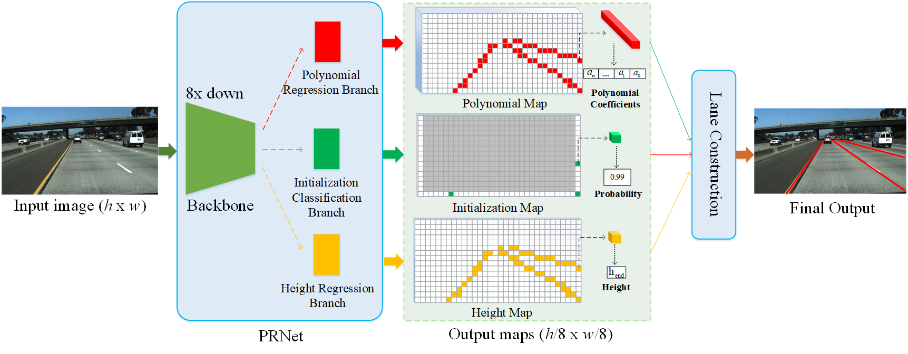
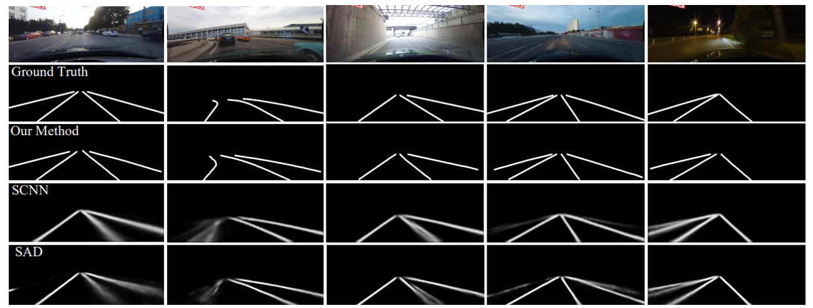

# Polynomial Regression Network for Variable-Number Lane Detection
This repository is the official implementation of "Polynomial Regression Network for Variable-Number Lane Detection" (accepted by ECCV 2020). It is designed for lane detection task.
[Paper](https://www.ecva.net/papers/eccv_2020/papers_ECCV/papers/123630698.pdf) 

## Overall Network Architecture
Lane detection is a fundamental yet challenging task in autonomous driving and intelligent traffic systems due to perspective projection and occlusion. Most of previous methods utilize semantic segmentation to identify the regions of traffic lanes in an image, and then adopt some curve-fitting method to reconstruct the lanes. 
In this work, we propose to use polynomial curves to represent traffic lanes and then propose a novel polynomial regression network (PRNet) to directly predict them, where semantic segmentation is not involved. Specifically, PRNet consists of one major branch and two auxiliary branches: 
(1) polynomial regression to estimate the polynomial coefficients of lanes, (2) initialization classification to detect the initial retrieval point of each lane, and (3) height regression to determine the ending point of each lane. Through the cooperation of three branches, PRNet can detect variable-number of lanes and is highly effective and efficient.The overall architecture of PRNet is shown as below.




## Install & Requirements
The code has been tested on pytorch=1.0.1 and python3.6. Please refer to `requirements.txt` for detailed information.

**To Install python packages**
````
conda install --yes --file requirements.txt
````


## Demo
We provide a trained model and some demo images.
The trained model can be found in [prnet.pth](https://pan.baidu.com/s/1fiADGSgiS1zbQCa-jYaUwg).
For example, visualize our proposed method on the demo images, you can try:
````
CUDA_VISIBLE_DEVICES=0 python demo.py
````


## Citation
```
@inproceedings{wang2020polynomial,
  title={Polynomial Regression Network for Variable-Number Lane Detection},
  author={Wang, Bingke and Wang, Zilei and Zhang, Yixin},
  booktitle={European Conference on Computer Vision},
  pages={719--734},
  year={2020},
  organization={Springer}
}
```
